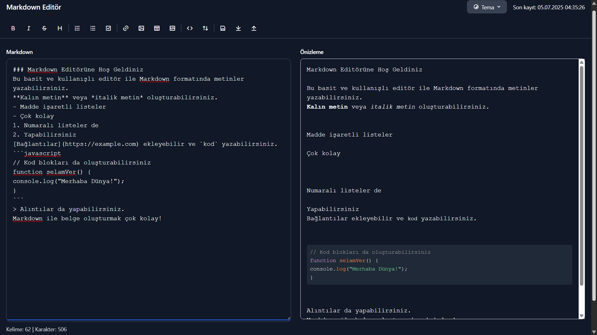

# Markdown Editör

Bu proje, kullanıcı dostu bir web tabanlı Markdown editörüdür. Markdown formatında metin yazmayı, önizlemeyi ve dışa aktarmayı kolaylaştıran modern bir arayüz sunar. Açık ve koyu tema desteği, klavye kısayolları, senkronize kaydırma ve dosya içe/dışa aktarma gibi özelliklerle hem yeni başlayanlar hem de deneyimli kullanıcılar için uygundur.

## Özellikler

- **Gerçek Zamanlı Önizleme**: Markdown metniniz yazarken anında HTML olarak önizlenir.
- **Biçimlendirme Araçları**: Kalın, italik, üstü çizili, başlıklar, listeler, bağlantılar, resimler, tablolar ve kod blokları eklemek için araç çubuğu ve klavye kısayolları.
- **Tema Desteği**: Açık ve koyu tema arasında geçiş yapma.
- **Senkronize Kaydırma**: Düzenleyici ve önizleme arasında senkronize kaydırma.
- **Dosya İçe/Dışa Aktarma**: Markdown (.md), HTML (.html) ve PDF (.pdf) formatlarında dışa aktarma; .md, .markdown ve .txt dosyalarını içe aktarma.
- **Geçmiş Desteği**: Geri alma (undo) ve yineleme (redo) işlevselliği.
- **Yerel Depolama**: Yazılan içerik ve tema tercihleri tarayıcıda saklanır.
- **Erişilebilirlik**: Klavye navigasyonu ve ekran okuyucu desteği için `aria` özellikleri.
- **Yardım Menüsü**: Markdown sözdizimi ve klavye kısayollarını açıklayan bir yardım modalı.
- **Kelime ve Karakter Sayacı**: Yazılan metnin kelime ve karakter sayısını gösterir.

## Teknolojiler

- **HTML5**: Yapısal temel.
- **Tailwind CSS**: Modern ve duyarlı tasarım.
- **JavaScript**: İnteraktif özellikler ve olay yönetimi.
- **Marked.js**: Markdown ayrıştırma.
- **html2pdf.js**: PDF dışa aktarma.
- **Prism.js**: Kod sözdizimi vurgulama.
- **Web Worker**: Performanslı Markdown işleme.
- **Remixicon**: İkon seti.

## Kurulum

Proje tamamen istemci tarafında çalışır ve ek bir sunucuya ihtiyaç duymaz. Aşağıdaki adımları izleyerek projeyi çalıştırabilirsiniz:

1. **Depoyu Klonlayın**:
   ```bash
   git clone https://github.com/developerharmony/markdown-editor.git
   cd markdown-editor
   ```

2. **Projeyi Açın**:
   - `index.html` dosyasını herhangi bir modern web tarayıcısında (Chrome, Firefox, vb.) doğrudan açın.
   - Alternatif olarak, Visual Studio Code gibi bir düzenleyicide **Live Server** eklentisi ile projeyi çalıştırabilirsiniz.

## Kullanım

1. **Metin Yazma**: Markdown metninizi sol taraftaki düzenleyiciye yazın. Önizleme sağ tarafta gerçek zamanlı olarak güncellenir.
2. **Biçimlendirme**: Araç çubuğundaki düğmeleri veya klavye kısayollarını (ör. `Ctrl+B` kalın metin için) kullanın.
3. **Dışa Aktarma**: "Dışa Aktar" düğmesine tıklayarak metni Markdown, HTML veya PDF olarak kaydedin.
4. **İçe Aktarma**: "İçe Aktar" düğmesiyle mevcut .md, .markdown veya .txt dosyalarını yükleyin.
5. **Tema Değiştirme**: Sağ üstteki "Tema" düğmesinden açık veya koyu temayı seçin.
6. **Yardım**: Alt kısımdaki "Markdown Yardım" bağlantısına tıklayarak sözdizimi ve kısayol rehberine erişin.

### Klavye Kısayolları

| Kısayol | İşlev              |
|---------|--------------------|
| `Ctrl+B`| Kalın metin        |
| `Ctrl+I`| İtalik metin       |
| `Ctrl+T`| Üstü çizili metin  |
| `Ctrl+H`| Başlık ekleme      |
| `Ctrl+K`| Bağlantı ekleme    |
| `Ctrl+S`| İçeriği kaydet     |
| `Ctrl+Z`| Geri al            |
| `Ctrl+Y`| Yinele             |

## Ekran Görüntüleri


*Markdown düzenleyici ve önizleme ekranı*

## Katkıda Bulunma

Katkılarınızı memnuniyetle karşılıyorum! Yeni özellik önerileri, hata düzeltmeleri veya iyileştirmeler için:

1. Depoyu fork edin.
2. Yeni bir dal oluşturun: `git checkout -b feature/ozellik-adi`.
3. Değişikliklerinizi yapın ve commit edin: `git commit -m "Özellik açıklaması"`.
4. Dalınızı push edin: `git push origin feature/ozellik-adi`.
5. Bir Pull Request açın.

## Lisans

Bu proje [MIT Lisansı](LICENSE) altında lisanslanmıştır.

## İletişim

- **Geliştirici**: Harmony
- **GitHub**: [developerharmony](https://github.com/developerharmony)

© 2025 Markdown Editör. Tüm hakları saklıdır.